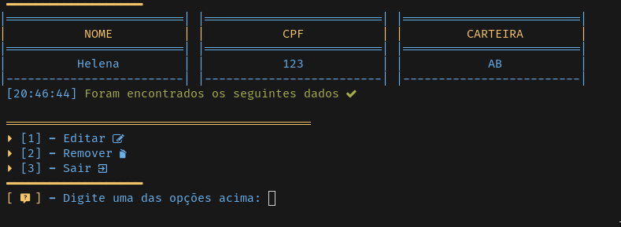

# Sistema de Viagem




###### Obs: Os dados precisarão ser persistidos em arquivo físico JSON

A aplicação se divide em três partes na qual cada uma irá ter uma responsabilidade específica, estas três partes são divididas em:

- **Model** (Irá escrever e modificar os dados persistidos no arquivo JSON).
- **View** (Exibição dos dados, para o usuário).
- **Controller** (Manipular a entrada de dados do usuario, será responsável por interligar o view e model).

##### Estrutura de pasta

```
projeto/
    data/
        motoristas.json
        veiculos.json
        viagem.json
    src/
      models/
        model.py
        motorista_model.py
        veiculo_model.py
        viagem_model.py
      controllers/
        motorista_controller.py
        veiculo_controller.py
        viagem_controller.py
      utils/
        date_convert.py
        handle_input.py
        handle_json.py
      views/
          view.py
          motorista_view.py
          veiculo_view.py
          viagem_view.py
      config.py
    main.py
```

## Os Views

Os views são arquivos responsáveis por gerar menus, existe um arquivo principal no qual possuí a lógica 
principal para gerar menus esse arquivo é o **view.py**. Com este arquivo é possível gerar menus dinâmicos
desde que siga um regra para a sua exibição, além diso, o **view.py** possui funcionalidades extras que realçam
a aplicação enquanto UI, por exemplo mensagens coloridas e renderização de tabelas dinâmicas.

##### Principais metódos encontrados no arquivo view.py
- render_menu()

- render_search_results()

- render_menu_edit_remove()

- beautiful_input_msg()

- sucess_msg()

- warning_msg()


## Os Models

Os arquivos models possuem funcionalidades que escrevem dados nos arquivos JSON ou resgatam dados do mesmo, 
assim como no **views**, o model possui um arquivo principal que carrega uma lógica abstrata para escrever 
e pesquisar por dados em arquivos JSON e por ser abstrato é possível implementar sua lógica em arquivos genéricos
JSON, esse arquivo model principal é o **model.py** onde a lógica mais "groceira" foi implementada.

##### Características desses arquivos
- Os dados irão ser armazenados em arquivos **JSON**, no qual serão lidos e escritos.
- Este arquivo só poderá ser acessado pelos arquivos **controllers**.
- Não permitir duplicidade de dados.
- Exigir confirmação de exclusão de dados.

##### Principais metódos encontrados no arquivo model.py
- find()

- update()

- insert()

- remove()

## Os Controllers
Irá manipular seus repectivos arquivos, por exemplo, o arquivo **motorista_controller.py**
só pode manipular os arquivo **motorista_view.py** e **motorista_model.py**, cada controller
recebe entrada de dados do usuário e com base nisso ele irá decidir se exibi um menu ou busca
dados nos models que irão ser fornecidos para os views.


## Utils

Os utils possuem alguns funcionalidades que auxiliam durante a codificação, por exemplo,
**converção de datas**, **manipular entradas do usuário** para que estas sejam fornecidas de 
forma correta até mesmo em **leitura e escrita de arquivos JSON**.

### Arquivos json

###### motorista.json

```
{
    "data": [
        {
            "id": "",
            "cpf": "",
            "nome": "",
            "carteira": "",
        },
    ].
}
```

###### veiculo.json

```
{
    "data": [
        {
            "id": "",
            "placa": "",
            "tipo": "",
            "motorista": none,
        },
    ].
}
```

###### viagem.json

```
{
    "data": [
        {
            "id": "",
            "veiculo": "",
            "rota": "",
            "status": false,
            "data": ""
        },
    ].
}
```
